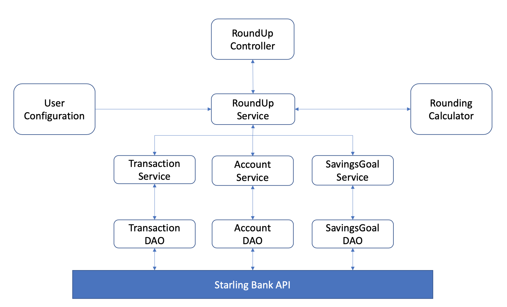

# Starling Bank Technical Challenge
Technical Challenge set by Starling Bank to Round-Up transactions for a given week and adding that combined amount into a Savings Goal

For a customer, take all the transactions in a given week and round them up to the nearest pound. For example with spending of £4.35, £5.20 and £0.87, the round-up would be £1.58. This amount should then be transferred into a s​ avings goal​, helping the customer save for future adventures.

#### Quick Start

* Checkout this project
* Get your own access token from https://developer.starlingbank.com/sandbox/
* Change `ACCESS_TOKEN` in `src/main/resources/application.properties` with your own access token
* Run Maven Build - `mvn clean install`
* Start Spring Boot Application 
`mvn spring-boot:run`
* Trigger the Round Up by accessing http://localhost:8080/roundUp on your browser

Java Version: 1.8.0_131

#### Design

* Used Spring due to personal familiarity and also it provides some useful features to conduct REST API calls 

* Controller provides a HTTP GET endpoint that will trigger the start of the process

* Chose to have a RoundUpService to bring together all aspects needed to roundup in order to keep the controller free of 
any business logic and to only handle the user endpoints. The same goes for the Account, Transaction and SavingsGoal 
Services, allowing for a better separation of concerns.  

* Using spring configuration I kept a UserConfiguration class that allows me to pull constants from the 
application.properties allowing for variable customisation without changing the code itself. This is also how I will 
retrieve the access token for a given user. However this with later work could be provided through a HTTP request to 
the controller.

* Used interfaces alongside implementations for services and DAO classes as this is generally good practice in a Spring Java project but it also allows for future implementations.

* Identified 5 different API calls needed to complete this.
    * Fetch Customer Account
    * Fetch Transactions
    * Create Savings Goal
    * Fetch Savings Goal
    * Add Funds to Savings Goal
    
#### Assumptions

* Only GBP Account used
* Only "OUT" direction transactions used
* You can only have one account of each currency
* Round up total will always be above 0 - future work I would correct this and not make an API call to add £0.00 to a savings goal (this would cause a currently unhandled response).
* Assuming that the round up applies to transactions up to today instead of transactions that took place between two past dates

#### Future Work

* Fetch Customer Details for greetings - e.g. Name
* More options to filter transactions - e.g. Contactless payments only
* Many areas of code need to be null checked and also check HttpStatus codes back from the API calls
    * Would also provide custom exceptions to handle these potential failures in the process
* E2E test
* Provide a HTTP POST endpoint to allow a user to add details such as access token into a request instead of changing the application.properties file